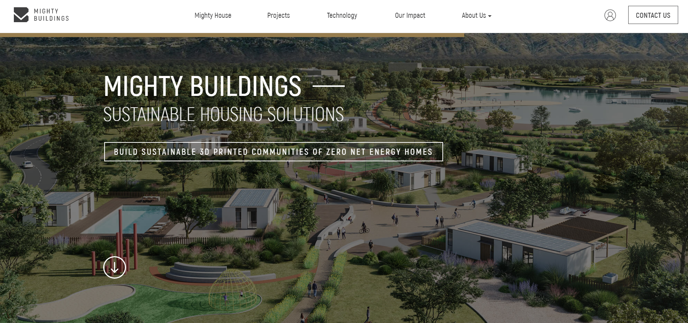
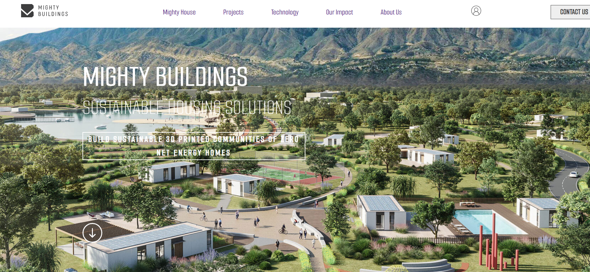

## Table of contents

- [Overview](#overview)
  - [The challenge](#the-challenge)
  - [Screenshot](#screenshot)
  - [Links](#links)
- [My process](#my-process)
  - [Continued Development](#continued-development)
  - [Built with](#built-with)
- [Author](#author)

## Overview
- This is a project I challenged myself to do to see how far I could get within a restricted amount of time WITHOUT ANY assets OR DIRECTION, to clone the home page of a website.
- I gave myself four hours spread throughout 2 days.
- I chose the Mighty Buildings site due to my personal passion for eco-friendly, sustainable home construction.

### The challenge
- To see how close to the actual website I could get in a restriced amount of time.

Users should be able to:

- View the optimal layout for the component depending on their device's screen size
- Tab through or use a sight reader for acessibility

### Screenshot

- Mighty Buildings:
- My Timed Clone:

### Links

- Mighty Buildings Website: [(https://mightybuildings.com/)]
- My Clone/Mock-up: [(https://slimbloodworth.github.io/Mighty-Buildings-Timed-Clone/)]

## My process
- I did NOT use any wireframes or libraries. This was from scratch custom coding.
- I used Chrome Dev tools to secure the images, colors, fonts, links and other assets.
- I tried to mantain accessibility throughout each step of the process.

### Continued Development
- This was a far as I got in the allotted time I gave myself and I was ironing out the responsivness when that time expired, so there's still a lot of things to be done in this area.
- I was able to get most of the accessibility in and some of the SEO. 
- I did not have time to go back and dry it out or clean it up, so it's spaghetti at this point in time.

### Built with

- Semantic HTML5 markup
- CSS custom properties
- Flexbox
- Mobile-first workflow
- JavaScript

## Author
- CodePen - [@slimbloodworth](https://codepen.io/slimbloodworth)
- LinkedIn - [Michelle Renee Bloodworth](https://www.linkedin.com/in/michelle-renee-99b455187/)
- GitHub - [@slimbloodworth](https://github.com/SlimBloodworth)
